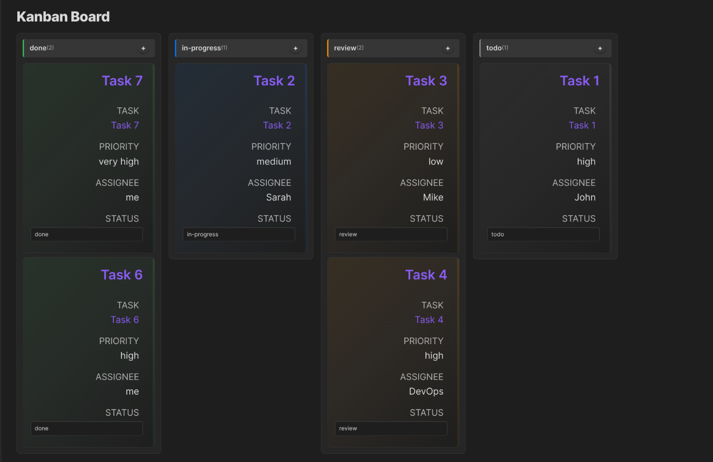

# Kanban Boards

DataCards includes a powerful kanban preset that transforms your notes into interactive task boards. Perfect for project management, task tracking, and workflow visualization.



## Quick Start

Create a kanban board with just a few lines:

````markdown
```datacards
TABLE file.link as "Task", priority, assignee, status
FROM #project-tasks
SORT status ASC

// Settings
preset: kanban
```
````

## Key Features

### Automatic Organization
- **Column Grouping**: Notes are automatically organized into columns by their `status` property
- **Smart Sorting**: Tasks appear in the correct columns based on their frontmatter
- **Dynamic Updates**: Columns adjust automatically as you add or modify notes

### Inline Editing
- **Status Dropdowns**: Change task status directly from the kanban board
- **Instant Updates**: Status changes are saved immediately to note frontmatter
- **Visual Feedback**: Cards move between columns when status changes

### Task Creation
- **Column Buttons**: Create new tasks using "+" buttons in column headers
- **Empty State Support**: Start with an empty board and create your first task
- **Smart Tagging**: New tasks automatically get the correct tags to appear in your board
- **Status Selection**: Choose which column new tasks should appear in

### Visual Customization
- **Custom Colors**: Define colors for different status values
- **Theme Integration**: Colors adapt to your Obsidian theme
- **Professional Design**: Clean, modern appearance suitable for any workspace

## Basic Example

Here's a simple kanban setup for personal task management:

````markdown
```datacards
TABLE file.link as "Task", priority, due, status
FROM #personal-tasks
SORT status ASC

// Settings
preset: kanban
```
````

**Required Note Structure:**
```yaml
---
title: Complete project proposal
status: todo
priority: high
due: 2024-01-15
tags: [personal-tasks]
---

# Complete project proposal

Details about the task...
```

## Advanced Customization

### Custom Status Options

Define your own status values for the dropdown menus:

````markdown
```datacards
TABLE file.link as "Task", priority, assignee, status
FROM #development-project
SORT status ASC

// Settings
preset: kanban
kanbanStatusOptions: ["backlog", "active", "testing", "deployed"]
```
````

> **Important**: Object settings like `kanbanStatusOptions`, `kanbanColors`, and `newTaskTemplate` must be written on a single line. Multi-line objects are not supported by the settings parser.

### Color Coding

Customize colors for better visual organization:

````markdown
```datacards
TABLE file.link as "Task", priority, assignee, status
FROM #marketing-campaign
SORT status ASC

// Settings
preset: kanban
kanbanStatusOptions: ["planning", "in-progress", "review", "done"]
kanbanColors: {"planning": "blue", "in-progress": "orange", "review": "purple", "done": "green"}
```
````

**Correct single-line format:**
```
kanbanColors: {"todo": "blue", "in-progress": "orange", "review": "purple", "done": "green"}
```

**Incorrect multi-line format (will not work):**
```
kanbanColors: {
  "todo": "blue",
  "in-progress": "orange",
  "review": "purple",
  "done": "green"
}
```

### New Task Templates

Configure automatic properties for new tasks:

````markdown
```datacards
TABLE file.link as "Task", priority, assignee, due, status
FROM #team-project
SORT status ASC

// Settings
preset: kanban
newTaskPath: "Projects/Team Tasks"
newTaskTemplate: {"priority": "", "assignee": "", "due": "", "project": "Team Project Alpha"}
```
````

## How It Works

### 1. Query Setup
Use any Dataview query that includes a `status` property. The kanban preset will automatically group results by this property.

### 2. Automatic Grouping
Notes are organized into columns based on their status values. Each unique status becomes a column.

### 3. Interactive Editing
Click the status dropdown on any card to change its status. The note's frontmatter is updated immediately.

### 4. Task Creation
Use the "+" button in column headers to create new tasks. They'll automatically:
- Get the correct status for that column
- Include the query's tag (e.g., from `FROM #project-tasks`)
- Use your template properties
- Be saved to your specified path

### 5. Tag Management
New tasks automatically receive the tag from your query's `FROM #tag` clause, ensuring they appear in the correct kanban board.

## Best Practices

### Note Organization
- **Use consistent tags**: Keep related tasks under the same tag (e.g., `#project-alpha`)
- **Standardize status values**: Stick to a consistent set of status options across projects
- **Include key properties**: Add properties like priority, assignee, and due dates for better task management

### Query Design
- **Filter appropriately**: Use `FROM #specific-tag` to isolate project tasks
- **Sort by status**: Use `SORT status ASC` for consistent column ordering
- **Include relevant properties**: Show the properties you need for task management

### Workflow Integration
- **Start with templates**: Define `newTaskTemplate` to ensure consistent task structure
- **Use meaningful paths**: Set `newTaskPath` to organize tasks in logical folders
- **Customize colors**: Use `kanbanColors` to match your project or team preferences

## Common Use Cases

### Personal Task Management
```datacards
TABLE file.link as "Task", priority, due, status
FROM #personal
SORT status ASC

// Settings
preset: kanban
kanbanStatusOptions: ["todo", "doing", "done"]
kanbanColors: {"todo": "blue", "doing": "orange", "done": "green"}
```

### Team Project Management
```datacards
TABLE file.link as "Task", assignee, priority, due, status
FROM #team-project
SORT status ASC

// Settings
preset: kanban
kanbanStatusOptions: ["backlog", "sprint", "review", "done"]
newTaskTemplate: {"assignee": "", "priority": "medium", "sprint": "current"}
```

### Content Creation Pipeline
```datacards
TABLE file.link as "Article", author, wordcount, status
FROM #content-pipeline
SORT status ASC

// Settings
preset: kanban
kanbanStatusOptions: ["idea", "draft", "review", "published"]
kanbanColors: {"idea": "gray", "draft": "blue", "review": "orange", "published": "green"}
```

Perfect for agile workflows, personal productivity, and team collaboration!
